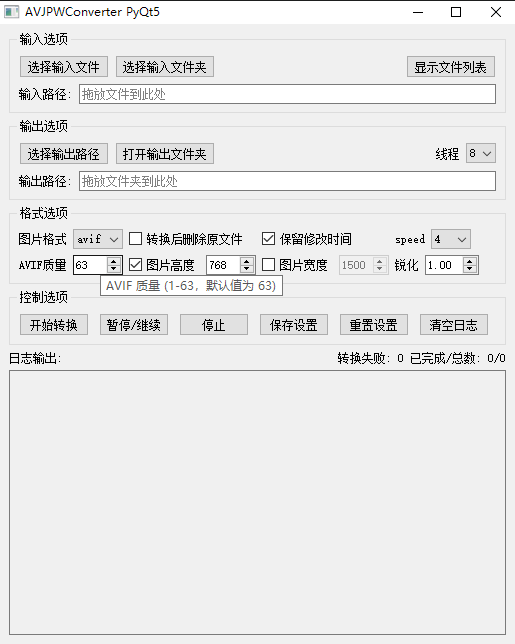

# AVJPWConverter 图片转换工具



支持 avif、png、jpg/jpeg、webp 文件格式的互相转换。支持多线程、批量处理、质量/压缩/锐化等参数自定义，支持配置文件保存与加载，适合图片批量转换和压缩优化场景。

## 主要功能

- 支持 avif、png、jpg/jpeg、webp 格式互转
- 支持批量文件/文件夹拖放与选择
- 支持多线程加速转换
- 支持转换后删除原文件
- 支持保留文件修改时间等元数据
- 支持按高宽最小值等比缩放
- 支持锐化处理（可调节锐化因子）
- 支持转换参数（质量、压缩等级、method、speed）自定义
- 支持设置保存/加载/重置
- 支持转换日志输出与进度显示
- 支持 nuitka 单文件编译部署

## 参数说明

- **图片格式**  
  - **jpg/jpeg**
    - 质量（quality）：1-100，默认 90，数值越高图片越清晰但体积越大。
  - **png**
    - 压缩等级（compress_level）：0-9，默认 6，数值越高压缩越强但速度越慢。
  - **webp**
    - 质量（quality）：0-100，默认 80。
    - method：0-6，默认 6，压缩优化等级，越大压缩越慢但质量更优。
  - **avif**
    - 质量（quality）：1-63，默认 63，数值越高图片越清晰但体积越大。
    - speed：0-10，默认 4，压缩速度，0最慢最优，数值越大速度越快但质量略降。

- **高宽缩放**  
  - 图片高度/宽度：可分别设置目标高度和宽度，支持按高宽最小值等比缩放，避免放大图片。
  - “图片高度”“图片宽度”复选框：勾选后启用对应的缩放，未勾选则不限制该方向。

- **锐化**  
  - 锐化因子（sharpness）：-2.0 ~ 3.0，默认 1.0。1.0 表示不处理，大于 1.0 增强锐化，小于 1.0 模糊化。适当锐化可减轻 avif 格式彩色线条糊化。

- **多线程**  
  - 线程数（cpu_threads）：1~CPU核心数，默认等于 CPU 核心数。线程数越多转换越快，但占用资源也越多。

- **转换后删除原文件**  
  - 勾选后，转换完成会自动将原文件移入回收站。

- **保留修改时间**  
  - 勾选后，输出文件会保留原文件的修改时间等元数据。

- **输出路径**  
  - 可指定输出文件夹，不指定时输出到原文件夹。

- **method/speed 参数**  
  - 仅在 webp/avif 格式下可见，分别对应 webp 的 method 和 avif 的 speed 参数。

- **配置文件**  
  - 配置文件名：`config.ini`，与程序同目录。
  - 需手动点击“保存设置”按钮保存当前参数，启动时自动加载。

- **日志输出**  
  - 转换过程、错误、进度等信息会实时输出到日志区。

- **其他**  
  - 支持批量拖放文件/文件夹到输入框或输出框。
  - 支持暂停/继续/停止转换任务。
  - 支持显示待转换文件列表。


- 用 nuitka 编译为单 exe 文件，流程跟命令Actions有

## 命令行批量图片转换脚本 image_converter.py/rs 有rust迁移编译的打算 能压到800k单exe

`image_converter.py` 是一个支持多线程的命令行图片批量转换工具，适用于如 epub 电子书图片批量格式转换等自动化场景。支持 jpg/png/webp/jpeg 格式互转，支持递归目录、文件列表、锐化、缩放等参数。

### 用法示例

python image_converter.py -i 1.jpg 2.png 3.webp -f webp -q 80 -H1300 -W1500 -s1.0 -w 8


支持递归目录、文件列表（如 `@list.txt`），适合批量处理 epub 图片。

### 参数说明（-h 输出）

```text
usage: image_converter.py [-h] -i INPUT [INPUT ...] [-o OUTPUT] [-f {webp,jpg,png,jpeg}] [-q QUALITY] [-W WIDTH] [-H HEIGHT] [-s SHARPNESS] [-m METHOD] [--workers WORKERS]

CLI Image Converter (支持多文件/目录)

options:
  -h, --help            显示帮助信息并退出
  -i INPUT [INPUT ...], --input INPUT [INPUT ...]
                        输入文件、目录或文件列表（支持 @list.txt 格式）
  -o OUTPUT, --output OUTPUT
                        输出目录
  -f {webp,jpg,png,jpeg}, --format {webp,jpg,png,jpeg}
                        输出图片格式，默认 webp
  -q QUALITY, --quality QUALITY
                        质量参数，默认 80
  -W WIDTH, --width WIDTH
                        调整宽度（保持比例）
  -H HEIGHT, --height HEIGHT
                        调整高度（保持比例）
  -s SHARPNESS, --sharpness SHARPNESS
                        锐化强度（默认 1.0，<1.0 模糊，>1.0 锐化，建议 0.5-2.0）
  -m METHOD, --method METHOD
                        WebP压缩等级 1-6 默认6 越大压缩越慢越优 原值默认4
  --workers WORKERS, -w WORKERS
                        并发线程数，默认2
```

### 典型应用

- 批量转换 epub 电子书内图片格式，提升兼容性或压缩率
- 目录/文件列表递归处理，适合自动化脚本集成
